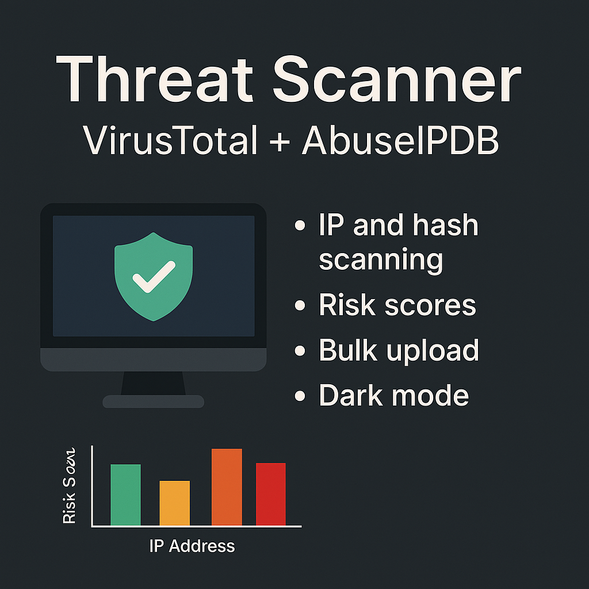

# 🔎 Threat Scanner - VirusTotal + AbuseIPDB GUI Tool

A powerful Python-based desktop application to scan IPs, domains, and file hashes using [VirusTotal](https://www.virustotal.com/) and [AbuseIPDB](https://www.abuseipdb.com/). It features a responsive GUI, threat scoring, metadata display, and bulk scanning support.

---

## 🧰 Features

- 🔍 Scan IPs, domains, and file hashes
- 📊 Risk scoring system with color-coded levels
- 🌐 VirusTotal + AbuseIPDB integration
- 🧾 Show:
  - File name (for hashes)
  - IP metadata (ISP, ASN, Country, etc.)
- 📂 Bulk scan support (mixed IPs and hashes)
- 📉 View results in a bar chart
- 🌓 Dark Mode toggle
- 🧹 Clear output anytime
- ⚙ API key configuration (no file editing needed)
- 🧠 Helpful tooltips on every action

---

## 🧠 Ideas for Future Improvements
- CSV or PDF export
- GeoIP map visualization
- Slack/email alert integration
- Local scan history (SQLite)
- Command-line mode

## ⚠️ Disclaimer
This tool uses public APIs. Be aware of API rate limits on free tiers. You must comply with [VirusTotal Terms](https://docs.virustotal.com/docs/how-it-works) and [AbuseIPDB Terms](https://www.abuseipdb.com/legal).

